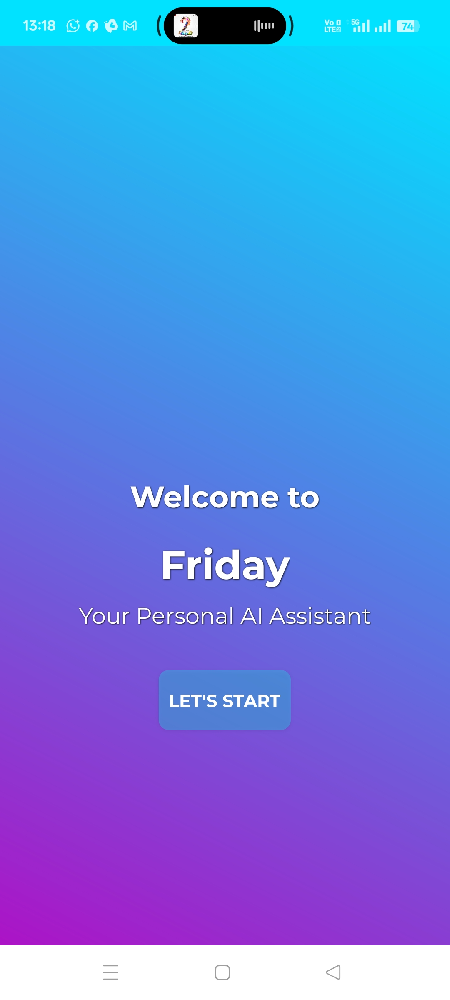

# 👋 Hi, I’m Tanmay Manna

<h3 align="center">💼 Executive @ Tata Motors | 📊 Data Science Trainee @ Masai School</h3>

  🤖 AI/NLP Enthusiast · 🚀 Skilled in Python, SQL, Power BI, TensorFlow Lite, Android Development

## 🚀 Featured Projects

### 🤖 FRIDAY – AI Voice Assistant

**Objective:** Android-based AI assistant with wake-word activation, task execution, and natural conversations.  
**Tech:** Kotlin, Python, BERT NLP, Google Cloud API, Firebase, TensorFlow Lite, AWS EC2  

**Highlights:**
- 🎯 Wake-word model reduces false triggers by **40%**
- 🗣️ Conversational and context-aware — remembers past commands for smoother interactions
- 🌍 Location-based responses (e.g., weather, nearby places)
- 🤝 Understands user intent with NLP, adapting to different phrasings

**Result:** Functional AI assistant with calling, reminders, money transfer prompts, and real-time Q&A.  

[🎥 Watch Demo](https://drive.google.com/file/d/1MB0px0Ad6Fr7D4NvQJAu6gG7mB6tE9W-/view?usp=sharing)

---

### 📚 BookMarket Analyzer – Web Scraping, SQL Insights & EDA
**Objective:** Scrape book data, analyze via SQL, visualize with EDA.  
**Tech:** Python, MySQL, BeautifulSoup, pandas, matplotlib, seaborn  

**Highlights:**
- 💰 Most books priced under **£30**  
- ⭐ Higher price trend for **4–5 star** books  
- 📦 High stock availability across categories  

**Result:** End-to-end pipeline from data collection to actionable insights.  

## 🛠 Skills & Tools

---

## 📫 Connect With Me

---

---

  

  <b>📩 Reach me on:</b>  
  
  

